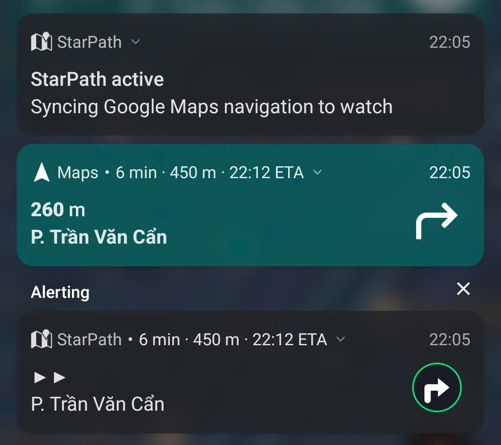

[StarPath](https://github.com/LiberiFatali/starpath) puts Google Maps turns on the [Amazfit Active 2](https://us.amazfit.com/products/active-2-round). It reposts navigation as big text cards like `◀◀ 40 m`. The Zepp app mirrors that text to the watch. The watch shows text only. Images never arrive.

In the first version of StarPath, my watch missed all turns. My phone showed a clear left arrow. My wrist showed nothing.

## Design for the narrowest channel

Every pipeline has a narrow hop. Mine sits between phone and watch: text passes, images die.

I built for the wide end first. I rendered sharp arrows for the phone shade and assumed the watch would show them. It never did. Only title and body travel over Bluetooth.

The fix started when I stopped asking what I sent and asked what actually survived. The answer was plain text, a street name, and a distance. Everything else had to become text before the hop, or it vanished.

## Treat missing data as missing

Maps often posts icon-only directions: a distance plus a street name, no verb. No "turn left." No "head south." Just `40 m` and a road.

A parser sees nothing to parse. That is not failure. That is absence.

I first treated these cards as errors. Then I routed them to a second signal. Text decides when it knows. Pixels decide only when text runs dry. Each source owns its strength, and neither begs the other for help.

Name the absence. Then pick the next-best evidence.

## Prefer the stable weak signal

The rich fix tempted me: open Maps' private notification layout and read its hidden instruction field. Others had mapped it. It worked in the lab.

It broke in the field. Maps ships often. Each release moves fields. Each phone skin renders them a little differently. My background listener grew heavy with layout code that chased someone else's UI.

I dropped it.

The weak signal won: the small direction arrow attached to every notification. It carries less information, but it always ships. It needs no private API and no layout inflation. It survives updates because Maps itself needs it.

Choose the signal you can keep.

## Match the invariant, not the picture

I tried to match arrows the obvious way. I compared whole icons against stored icons. I compared arrowheads against stored heads.

Both failed on real rides. Thin arrows scored too low to trust. Thick arrows tied: one left hook matched left and right equally, because its fat corner resembled both. Shift, thickness, and dash style broke every template. They vary constantly and mean nothing.

A turn arrow holds one stable trait. Its top leans one way and its foot anchors the other way. A left hook carries weight high on the left and low on the right. A right hook mirrors it. A straight arrow stacks its weight down the center.

So the working check ignores style and weighs position. It finds the arrow, shrinks it to a tiny grid, centers it, and compares where the upper mass sits against the lower mass. Left leans left. Right leans right. Center holds straight.

```
upper mass:      left | center | right
lower mass:      right| center | left
verdict:         turn | go on  | turn
```

Thickness cancels out. Dashes cancel out. Shift cancels out. The subtraction keeps only direction, which is all the rider needs.



## Order evidence, then admit ignorance

The order matters more than any single check:

1. Trust words first. They name U-turns, roundabouts, and exits best.
2. Trust pixels second, and only when words stay silent.
3. Show `?` when both stay silent.

That last step took discipline. A straight arrow feels helpful. It also sends riders through intersections when the classifier guesses wrong. Short fragments, lone heads without shafts, and blank icons all earn a question mark. A question mark tells the truth: glance at your phone.

A confident wrong answer costs more than an honest gap.

## What I kept

The watch still shows four glyphs: `◀◀` go left, `▶▶` go right, `▲▲` go on, `?` look up. Icon-only turns now resolve instead of shrugging. Unknowns still shrug instead of lying.

The broader lessons travel well beyond watches: find the narrowest channel, name missing data, pick stable signals, match invariants, order your evidence, and prefer doubt over false confidence.

Glance only. Never touch your watch while riding.
